# SOC Lab1

## Steps

- `git clone https://github.com/bol-edu/course-lab_1 ~/course-lab_1 && cd /course-lab_1`
- Export HLS to RTL as IP
    - change the part tp `xc7z020clg400-1`
    - comment out the `#pragma HLS INTERFACE ap_ctrl_none port=return`
    - Set the top function name (Project -> Project Settings -> Synthesis Settings -> set top funciton name)
    - Run C simulation, C synthesis, Co-simulation (Dump Trace all)
    - remove the comment of `#pragma HLS INTERFACE ap_ctrl_none port=return` before exporting to RTL

> :exclamation: **Note:** 
> - Change the directive as below when doing Co-simulation:
> 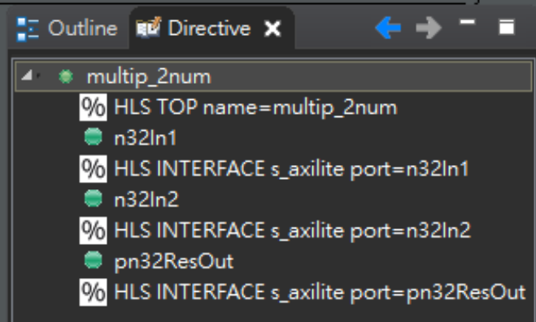

- Open vivado and import the mul IP
    - change the part tp `xc7z020clg400-1`
    - create block design and run block automation & connection automation
    - set the board clock too 100ns
    - create HDL wrapper
    - generate bitstream
- Rent the pynq-z2 board from OnlineFPGA and connect it

## Screen dump

- Tools Version
    1. vitis  
    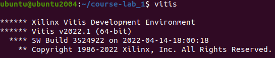
    2. vitis_hls  
    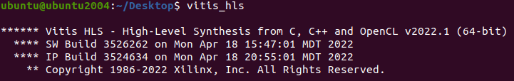
    3. vivado  
    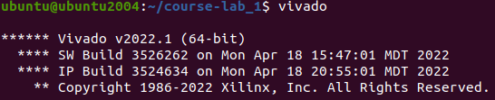
- co-simulation  
    雖然可以顯示waveform，但還有很多地方看不清楚哪個PIN對應到哪個變數  
    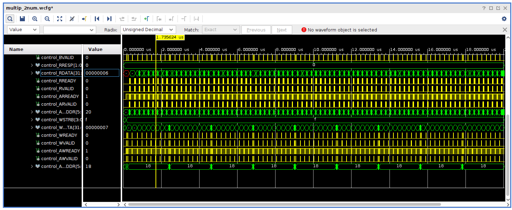  
- screen dump of some information  
    - 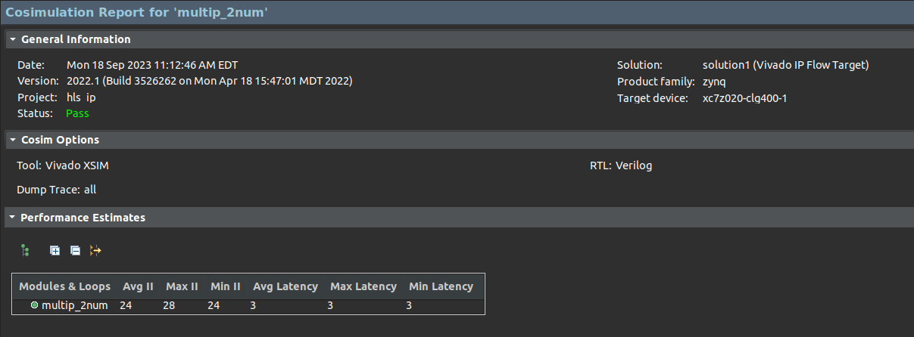  
    ---
    - 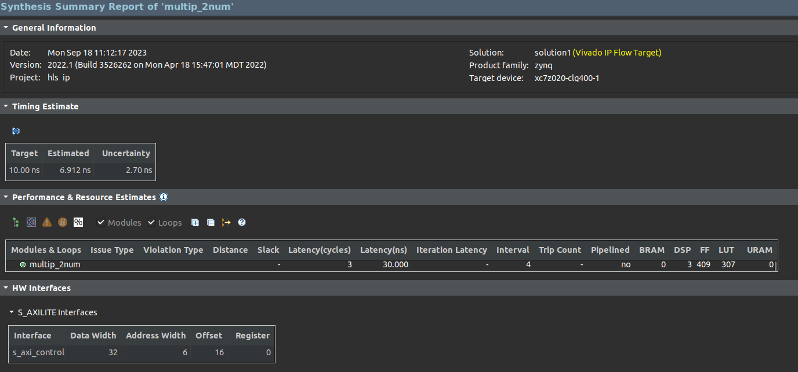 
    - 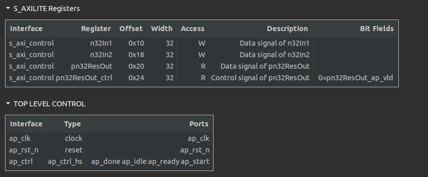 
    - 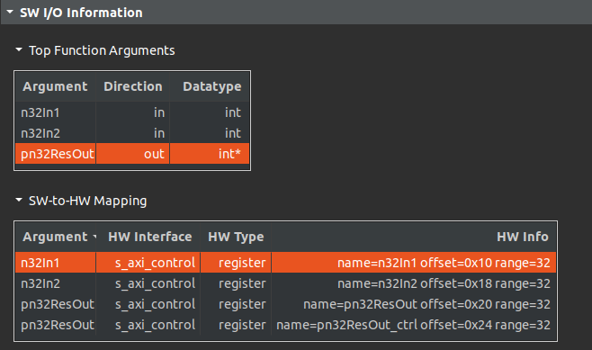

- Block Design  
    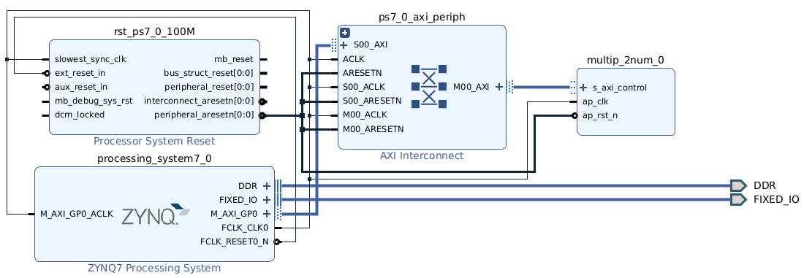

- Implement Design  
    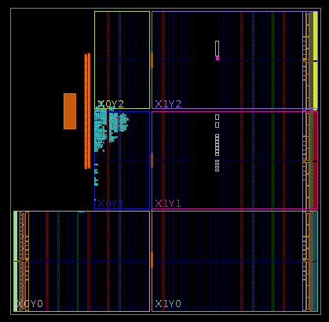

---

## Some Notes & Conclusion

### Notes
Vitis High-Level Synthesis is a development tools based on c++. It can convert the high level language to RTL language.

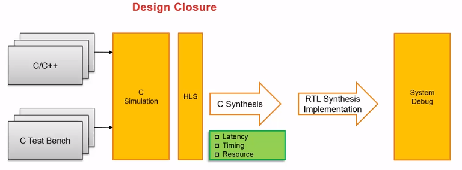

> Image ref: https://xilinx.eetrend.com/blog/2022/100560242.html

Vitis HLS **pragmas** and **directives** let you configure the synthesis results for your code.

`#pragma HLS INTERFACE` is use to create the RTL connection ports that will be used during the synthesis.

You can find the address of the I/O ports from the path shown in below:
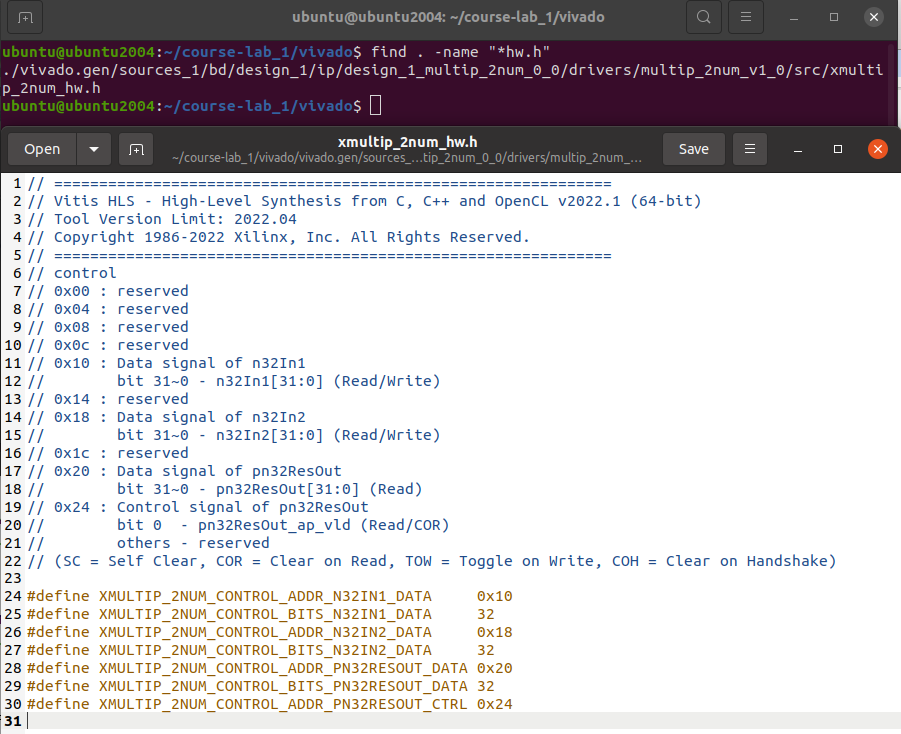

Load the bitstream:  
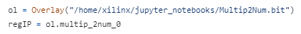
- Import MMIO (involving in Overlay): `ol = Overlay("/path/to/Multip2Num.bit")` 
- Define memory mapped region: `regIP = ol.multip_2num_0`
- And you can use the regIP to read or write the reg by its addr as follow:  
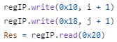

### Introduction about the overall system

使用vitis hls製作RTL的IP，匯出之後給vivado做block Design，使用AXI協定溝通之間的資料，最後產生bitstream供FPGA做測試。

### Conclusion

雖然本次作業已經打包好了，但從安裝環境到順利跑完線上FPGA驗證的過程也是相當複雜。除了需要理解每個操作的意義、每個東西的定位是什麼，都需要花不少時間慢慢以理解。
其中，了解axilite的協定，就是一門大學問，雖然在第二堂課程中，老師有講得很清楚什麼是ap_start, ap_done, ap_valid等等，但實際看到waveform的時候，要完全看懂其意思又是另外一回事。
但至少目前已經對簡單的dataflow有一定的理解。

