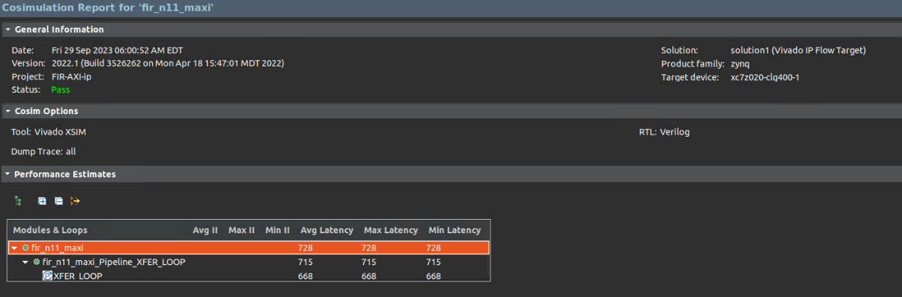
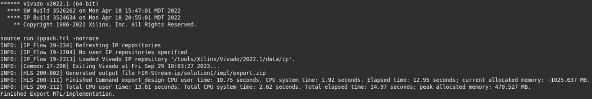
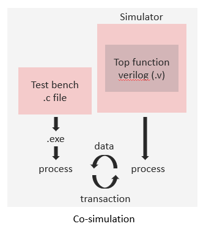

# SOC Lab2

## FIR AXI-Master as Interface

**Discovery:**
- If setting the depth more than 600 (e.g. 800), then there will be an error as shown below when doing co-simulation.
    
    
**Screen Dump:**
- simulation:
    
- synthesis:
    
- co-simulation:
        
    
- Export RTL as vivado IP
    
- Run Block Automation before configure the procressing system
- AXI-Lite 與 AXI-Master 在 processing system block 使用的 port 並不相同，所以在Run Block Automation 後用滑鼠左鍵雙擊 processing system block，開啟 HP port 設定。
- Block Design
    
- Memory map
    
- Implement Design
    
- Power
    
- Online FPGA
    

## FIR Stream as Interface

- simulation
    
- synthesis
    
- co-simulation
        
    
- Export RTL as vivado IP
    
- Block Design: Add two AXI DMA for read and write respectively. Moreover, connect two wires in manual.
    
- Memory map
    
- Spend more time on generating bitstream.
- Implement Design
    
- Power
    
- Online FPGA
    
    

## Brief introduction about the overall system

本次LAB是實作FIR並且利用不同的Interface傳輸測試資料，分別是AXI_Master跟AXI_Stream，兩者在設定Interface組態也是利用不同的方法，前者是使用插入directive，後者則是用pragma。  
從實驗結果得知，在傳輸大量資料的時候，使用AXI_Master會有較好的時間成本，原因在於AXI_Stream要需要額外的硬體資源AXI-DMA來協助，再者可能的原因是Stream的暫存是FIFO所以資料是一個一個傳送，而AXI_Master有Memory-mapped的概念可以直接映射資料的記憶體位置。
總而言之，若是需要隨機存取資料的方式存取資料的話，可以選擇AXI_Master作為傳輸介面;若是連續記憶體測試資料，可則可以使用AXI_Stream。

## What is observed & learned

### Differences between MAXI and Stream interface
||MAXI|Stream|
|-|----|------|
|Kernel func arguments|Pointer to an Array|hls:stream|
|Address Idea|yes|no|
|Direction|Input/Output|Input or Output only|
|DMA|not need|need|
|Stroage for test data|Create buffer|Define stream|
|Latency of Kernel function|728(fast)|6606(slow)|
|Execution time in online FPGA|0.6ms(fast)|1.7ms(slow)|

### Differences between csim and cosim

- C-simulation: Test bench and top function will compile together into one execution file.
- Co-simulation: Top function will run in a simulator. While the data will be transferred between the processes that invoked by test bench and simulator. 